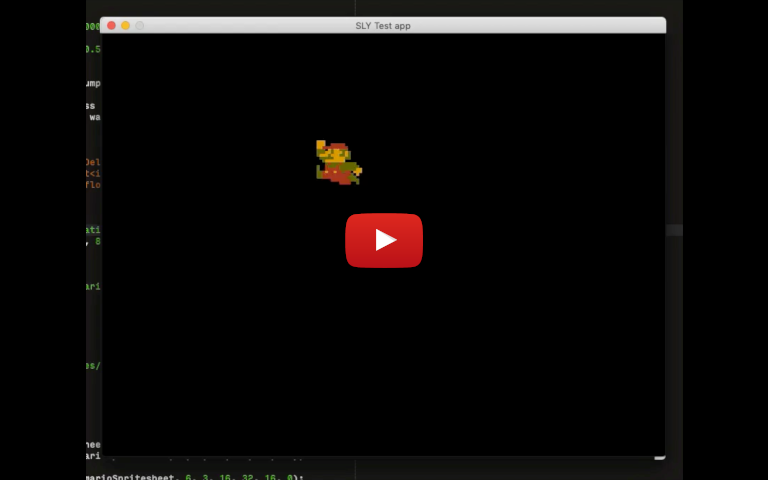
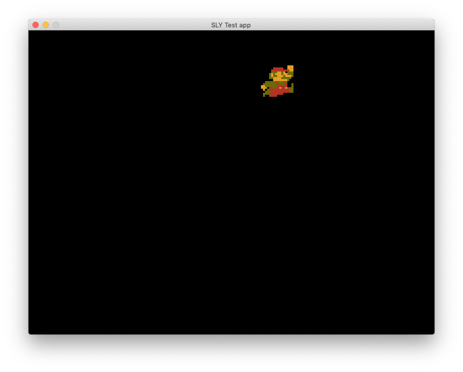

SLY is a toolkit for creating graphical applications using the [Simple Directmedia Library 2 (SDL2)](https://www.libsdl.org/).

## Status

The screenshot shows the SLY demo application running. It is much more impressive [in motion](https://youtu.be/RbtVQjAB4jU).

### Features:
- Singleton window and renderer classes
- Image class
- Font class
- Music and Sound classes
- Spritesheet class
- Animation class

## Building
SLY uses [Shake](https://shakebuild.com/). It depends on [SDL2](https://www.libsdl.org/), [SDL2_image](https://www.libsdl.org/projects/SDL_image/), [SDL2_ttf](https://www.libsdl.org/projects/SDL_ttf/), and [SDL2_mixer](https://www.libsdl.org/projects/SDL_mixer/).

After installing the dependencies, simply run `./build.sh` from the project folder.

## Manual
Include the SLY header: [`./src/lib/SLY.hpp`](src/lib/SLY.hpp). Link with the SLY shared library `./dst/dgb/libsly.dylib` (or your OS equivalent).

Use `./run.sh` to run the demo application.
